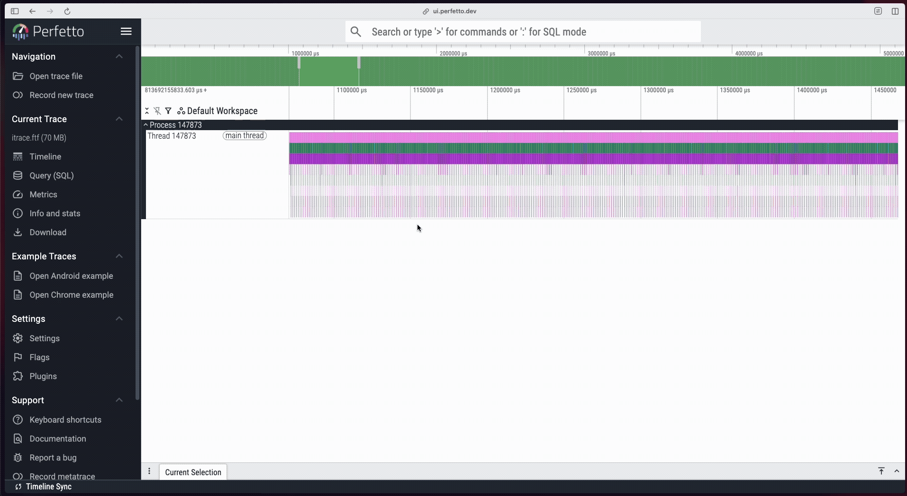

# itrace

`itrace` is a processor level runtime tracing tool built around the Intel
Processor Trace technology. 

Record a trace with `itrace record` and convert it to Fuchsia format with
`itrace export`.


Export to [Perfetto](https://ui.perfetto.dev/) to view a flamegraph of the
trace in your browser. Select your portion of interest and copy the time range.


Decode the trace with `itrace decode`. Select a timerange of interest from the
Perfetto flamegraph.


## Setup
```
sudo apt update
sudo apt install linux-tools-generic
sudo apt install cmake
echo -1 | sudo tee /proc/sys/kernel/perf_event_paranoid
./setup.py
sudo ./setup.py --install
```

Optionally, if you want to export and view the traces on
[Perfetto](https://ui.perfetto.dev/), you can build with the exporter. The
exporter requires Rust and Cargo which can be installed
[here](https://rust-lang.org/tools/install/).

```
sudo apt install llvm clang libclang-dev
./setup.py --export
sudo ./setup.py --install
```

## Acknowledgements
`itrace` relies heavily on other projects for its functionality. Thank you to these projects!
- [`perf`](https://perfwiki.github.io/main/) handles all of the interfacing
with Intel Processor Trace. `itrace` is really just a nice wrapper around
`perf`.
- [`xed`](https://github.com/intelxed/xed) is used for decoding x86 instructions
- [`perf2perfetto`](https://github.com/michoecho/perf2perfetto) is used for
export `perf`'s trace format to Fuchsia trace format for viewing on Perfetto
